# EdgeIQ - Architecture Documentation

> A comprehensive sports betting intelligence platform with prediction algorithms, bankroll management, and real-time odds tracking.

## Table of Contents

- [Overview](#overview)
- [System Architecture](#system-architecture)
- [Component Hierarchy](#component-hierarchy)
- [Data Flow](#data-flow)
- [State Management](#state-management)
- [Prediction Engine](#prediction-engine)
- [Edge Functions](#edge-functions)
- [Database Schema](#database-schema)
- [External Integrations](#external-integrations)
- [Caching Strategy](#caching-strategy)
- [Security Architecture](#security-architecture)

---

## Overview

EdgeIQ is a React-based sports betting analytics platform that combines multiple data sources, prediction algorithms, and bankroll management tools to help users make informed betting decisions.

### Tech Stack

| Layer | Technology |
|-------|------------|
| **Frontend** | React 18, TypeScript, Vite |
| **Styling** | Tailwind CSS, shadcn/ui |
| **State** | TanStack Query (React Query), Context API |
| **Routing** | React Router v6 |
| **Backend** | Supabase (Lovable Cloud) |
| **Edge Functions** | Deno (Supabase Edge Functions) |
| **Database** | PostgreSQL with RLS |
| **Animations** | Framer Motion |

### Key Features

- Multi-league sports data (NBA, NFL, MLB, NHL, NCAAF, NCAAB, Soccer)
- Real-time odds from multiple sportsbooks
- Multiple prediction algorithms with backtesting
- Kelly Criterion stake sizing
- Sharp money detection
- Bankroll management & ROI tracking
- Push notifications for high-value alerts

---

## System Architecture

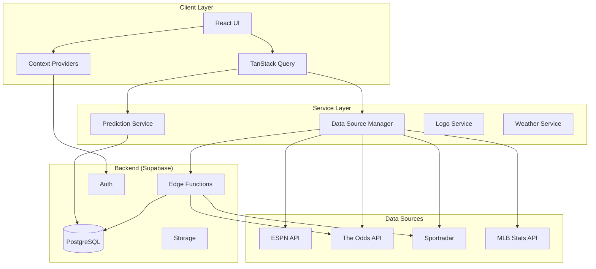

---

## Component Hierarchy

### Application Structure

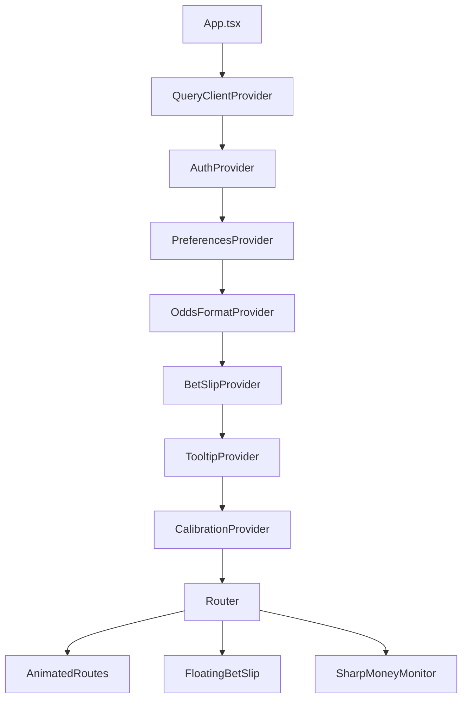

### Page Components

```
src/pages/
├── Index.tsx              # Main dashboard
├── GameDetailPage.tsx     # Single game analysis
├── LiveGamesPage.tsx      # Live scores & odds
├── GamesPage.tsx          # All games listing
├── BacktestSimulator.tsx  # Strategy backtesting
├── ROITracker.tsx         # Betting performance
├── BankrollManager.tsx    # Bankroll tools
├── BetHistory.tsx         # Bet tracking
├── AlgorithmsComparison.tsx # Algorithm performance
├── Settings.tsx           # User preferences
├── Auth.tsx               # Login/signup
├── Standings.tsx          # League standings
├── Injuries.tsx           # Injury reports
├── BettingTrends.tsx      # Public betting data
└── AIPredictions.tsx      # AI-powered picks
```

### Feature Component Groups

```
src/components/
├── layout/           # Navigation, headers, layout
├── ui/               # shadcn/ui primitives
├── MatchCard/        # Game cards & details
├── BetSlip/          # Betting cart system
├── Bankroll/         # Bankroll management
├── Backtest/         # Backtesting UI
├── SharpMoney/       # Sharp money alerts
├── BettingTrends/    # Public betting %
├── DevTools/         # Debug panels
└── filters/          # League/date filters
```

---

## Data Flow

### Sports Data Pipeline

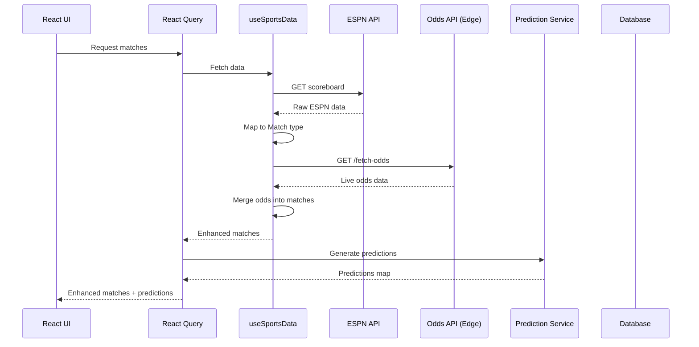

### Odds Recording Flow

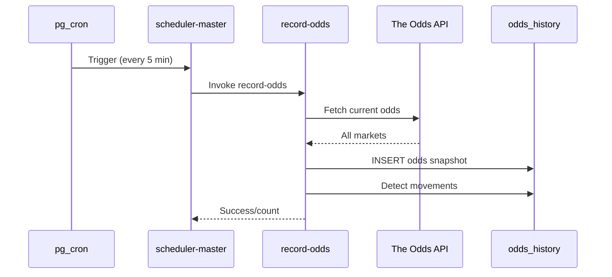

### Prediction Grading Flow

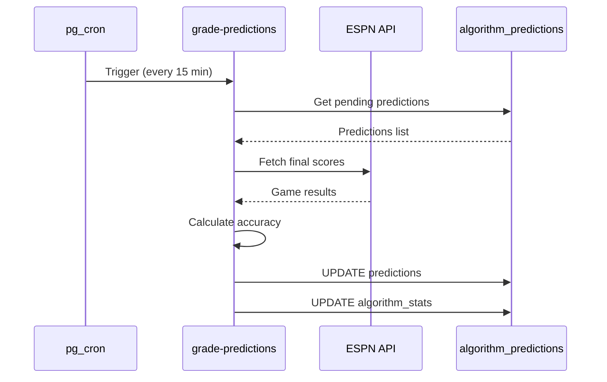

---

## State Management

### React Query (TanStack Query)

Primary state manager for server data. Configuration in `src/App.tsx`:

```typescript
const queryClient = new QueryClient({
  defaultOptions: {
    queries: {
      staleTime: 60 * 1000,     // 1 minute
      gcTime: 30 * 60 * 1000,   // 30 minutes cache
      retry: 3,
      refetchOnWindowFocus: false,
    },
  },
});
```

### Query Key Structure

Centralized in `src/config/queryKeys.ts`:

```typescript
queryKeys = {
  matches: {
    all: ['matches'],
    byLeague: (league) => ['matches', 'league', league],
    live: ['matches', 'live'],
  },
  predictions: {
    all: ['predictions'],
    byMatch: (matchId) => ['predictions', 'match', matchId],
  },
  odds: {
    byMatch: (matchId) => ['odds', matchId],
    history: (matchId) => ['odds', 'history', matchId],
  },
  // ... more namespaces
}
```

### Context Providers

| Provider | Purpose | Location |
|----------|---------|----------|
| `AuthProvider` | User session & profile | `src/hooks/useAuth.tsx` |
| `PreferencesProvider` | User settings | `src/hooks/usePreferences.tsx` |
| `OddsFormatProvider` | American/Decimal toggle | `src/contexts/` |
| `BetSlipProvider` | Active bets state | `src/contexts/` |
| `CalibrationProvider` | Model accuracy tracking | `src/contexts/` |

### Local State Patterns

- **Component state**: `useState` for UI-only state
- **Derived state**: `useMemo` for computed values
- **Bankroll settings**: `localStorage` via `useBankrollSettings`

---

## Prediction Engine

### Architecture

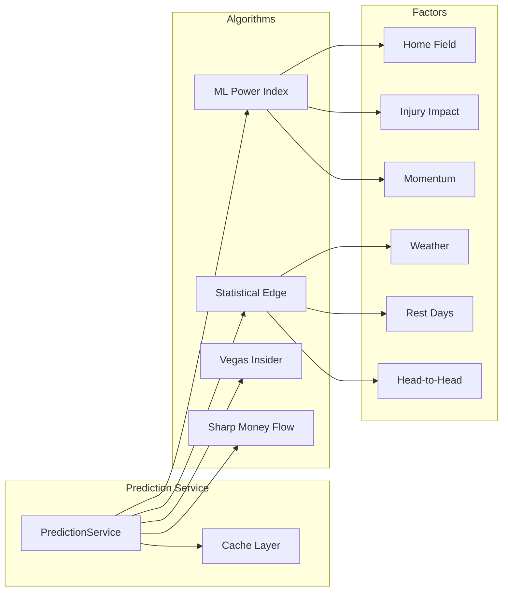

### Algorithm Registry

Located in `src/services/prediction/domain/prediction/algorithms/`:

| Algorithm ID | Description | Primary Factors |
|--------------|-------------|-----------------|
| `ML_POWER_INDEX` | Machine learning composite | All factors weighted |
| `STATISTICAL_EDGE` | Statistical modeling | Historical trends, variance |
| `VEGAS_INSIDER` | Line-based analysis | Opening/closing lines, CLV |
| `SHARP_MONEY_FLOW` | Smart money tracking | Line movements, betting % |
| `INJURY_ADJUSTED` | Injury-focused | Player impact ratings |
| `WEATHER_WEIGHTED` | Weather correlation | Temperature, wind, precipitation |

### Prediction Result Structure

```typescript
interface PredictionResult {
  matchId: string;
  recommended: 'home' | 'away' | 'draw';
  confidence: number;          // 0-100
  projectedScore: { home: number; away: number };
  trueProbability: number;     // 0-1
  impliedOdds: number;         // Decimal odds
  expectedValue: number;       // EV in dollars
  evPercentage: number;        // EV as percentage
  kellyFraction: number;       // Kelly stake fraction
  kellyStakeUnits: number;     // Recommended units
  factors: FactorBreakdown[];
}
```

---

## Edge Functions

### Function Inventory

```
supabase/functions/
├── _shared/                    # Shared utilities
│   ├── cors.ts                 # CORS headers
│   ├── rate-limiter.ts         # Rate limiting
│   └── supabase-client.ts      # DB client
├── fetch-odds/                 # Real-time odds
├── fetch-weather/              # Weather data
├── fetch-sportradar/           # Sportradar proxy
├── record-odds/                # Save odds history
├── grade-predictions/          # Score predictions
├── grade-bets/                 # Grade user bets
├── detect-line-movements/      # Line change alerts
├── capture-closing-odds/       # CLV calculation
├── sharp-money-api/            # Sharp money data
├── send-push-notification/     # Web push
└── scheduler-master/           # Cron coordinator
```

### Scheduled Jobs

| Job | Schedule | Function | Purpose |
|-----|----------|----------|---------|
| Record Odds | Every 5 min | `record-odds` | Snapshot odds |
| Grade Predictions | Every 15 min | `grade-predictions` | Update accuracy |
| Detect Movements | Every 5 min | `detect-line-movements` | Alert on moves |
| Capture Closing | At game time | `capture-closing-odds` | CLV tracking |
| Grade Bets | Every 15 min | `grade-bets` | Settle user bets |

### Edge Function Pattern

```typescript
// Standard edge function structure
import { serve } from "https://deno.land/std@0.168.0/http/server.ts";
import { corsHeaders } from "../_shared/cors.ts";
import { createClient } from "https://esm.sh/@supabase/supabase-js@2";

serve(async (req) => {
  // CORS preflight
  if (req.method === "OPTIONS") {
    return new Response(null, { headers: corsHeaders });
  }

  try {
    const supabase = createClient(
      Deno.env.get("SUPABASE_URL")!,
      Deno.env.get("SUPABASE_SERVICE_ROLE_KEY")!
    );

    // Business logic here

    return new Response(JSON.stringify({ data }), {
      headers: { ...corsHeaders, "Content-Type": "application/json" },
    });
  } catch (error) {
    return new Response(JSON.stringify({ error: error.message }), {
      status: 500,
      headers: { ...corsHeaders, "Content-Type": "application/json" },
    });
  }
});
```

---

## Database Schema

### Entity Relationship Diagram

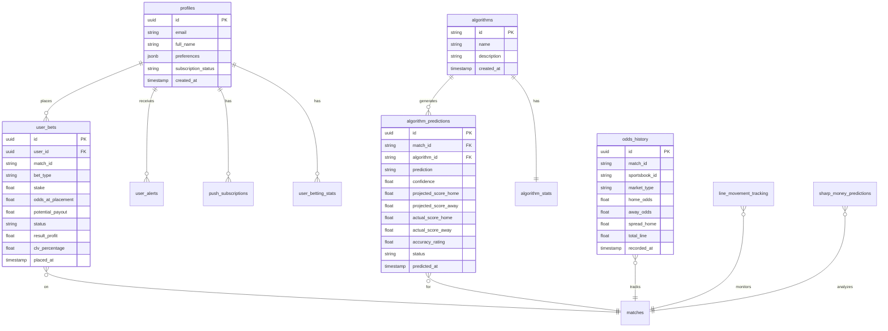

### Key Tables

| Table | Purpose | RLS |
|-------|---------|-----|
| `profiles` | User accounts | User-own |
| `user_bets` | Bet tracking | User-own |
| `user_betting_stats` | Aggregated stats | User-own |
| `user_alerts` | Notifications | User-own |
| `algorithm_predictions` | Model predictions | Public read |
| `algorithm_stats` | Algorithm performance | Public read |
| `odds_history` | Odds snapshots | Public read |
| `line_movement_tracking` | Line changes | Public read |
| `sharp_money_predictions` | Sharp money signals | Public read |
| `weather_cache` | Weather data | Service-only write |
| `venue_coordinates` | Stadium locations | Service-only write |

---

## External Integrations

### Data Sources

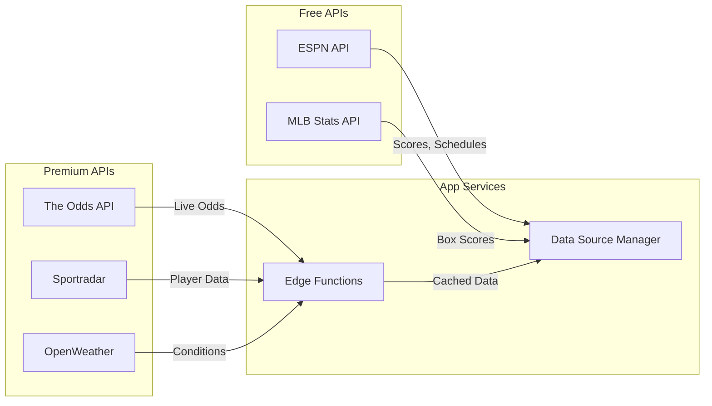

### API Integration Details

| API | Purpose | Rate Limit | Auth |
|-----|---------|------------|------|
| ESPN | Scores, schedules, standings | None (public) | None |
| MLB Stats | MLB box scores | None (public) | None |
| The Odds API | Live betting odds | 500/month | API Key |
| Sportradar | Injuries, player data | Varies | API Key |
| OpenWeather | Game-day weather | 1000/day | API Key |

---

## Caching Strategy

### Multi-Layer Cache

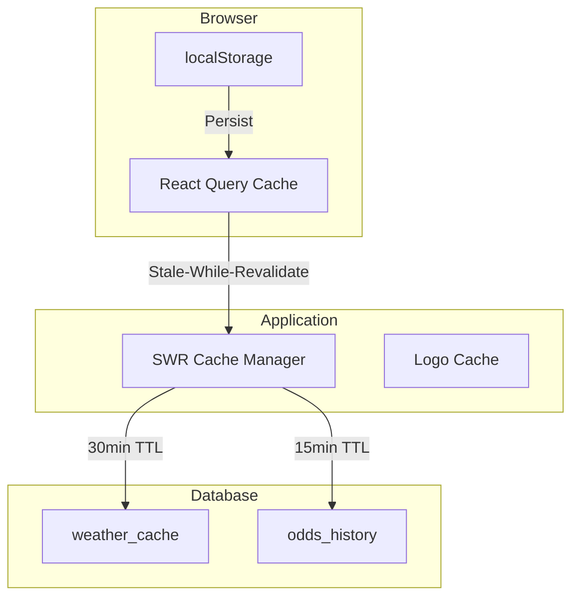

### Cache Configuration

| Data Type | Client TTL | Server TTL | Strategy |
|-----------|------------|------------|----------|
| Match list | 1 min | N/A | Stale-while-revalidate |
| Live scores | 15 sec | N/A | Polling |
| Odds | 5 min | 5 min | Database cache |
| Weather | 30 min | 60 min | Database cache |
| Predictions | 5 min | 24 hr | Service cache |
| Logos | Permanent | N/A | IndexedDB |

---

## Security Architecture

### Authentication Flow

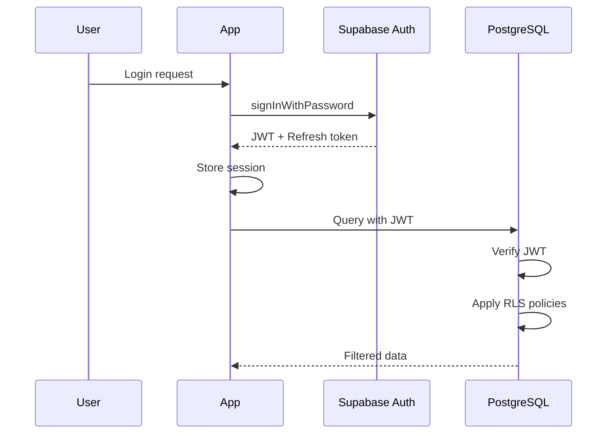

### Row Level Security

All user data tables have RLS enabled with policies:

```sql
-- Users can only access their own data
CREATE POLICY "Users can view own bets"
ON user_bets FOR SELECT
USING (auth.uid() = user_id);

-- Service role for system operations
CREATE POLICY "Service can insert weather"
ON weather_cache FOR INSERT
WITH CHECK (
  current_setting('request.jwt.claims')::jsonb->>'role' = 'service_role'
);
```

### API Key Management

| Secret | Purpose | Storage |
|--------|---------|---------|
| `ODDS_API_KEY` | The Odds API | Supabase Secrets |
| `SPORTRADAR_API_KEY` | Sportradar | Supabase Secrets |
| `OPENWEATHER_API_KEY` | Weather data | Supabase Secrets |
| `VAPID_*` | Push notifications | Supabase Secrets |

---

## Development Patterns

### Hook Naming Conventions

```
use{Feature}         # Primary data hooks (useSportsData)
use{Entity}Api       # API-specific hooks (useOddsApi)
use{Feature}Settings # Configuration hooks (useBankrollSettings)
use{Action}          # Action hooks (useSavePrediction)
```

### File Organization

```
src/
├── components/       # UI components (presentational)
├── hooks/            # Custom hooks (logic)
├── services/         # API & business logic
├── pages/            # Route components
├── contexts/         # React contexts
├── types/            # TypeScript types
├── utils/            # Pure utility functions
├── config/           # Configuration constants
├── lib/              # Third-party wrappers
└── integrations/     # External service clients
```

### Testing Strategy

| Level | Tool | Coverage Focus |
|-------|------|----------------|
| Unit | Vitest | Utilities, calculations |
| Component | Testing Library | UI interactions |
| Integration | Vitest + MSW | API flows |
| E2E | Playwright | Critical paths |

---

## Performance Considerations

### Optimization Techniques

1. **Virtualization**: Large lists use `@tanstack/react-virtual`
2. **Code Splitting**: Lazy loading for pages
3. **Memoization**: `useMemo` for expensive computations
4. **Debouncing**: Search inputs, resize handlers
5. **Prefetching**: Logo images via `useLogoPrefetch`

### Bundle Optimization

- Tree shaking enabled via Vite
- Dynamic imports for non-critical features
- Image optimization via responsive srcsets

---

## Deployment Architecture

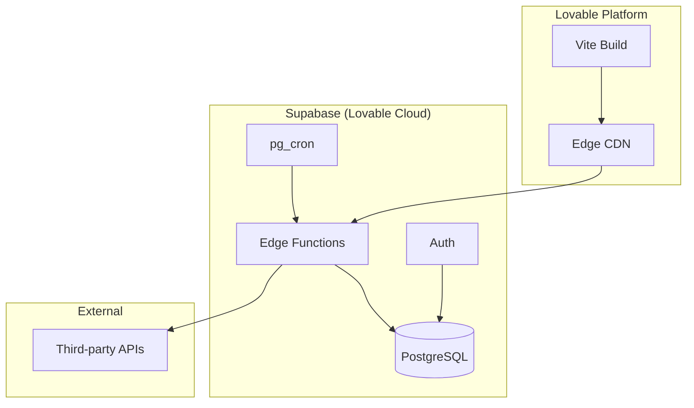

---

## Future Considerations

### Planned Enhancements

1. **Real-time subscriptions**: Supabase Realtime for live odds
2. **WebSocket scores**: Replace polling with push updates
3. **ML model training**: On-device model fine-tuning
4. **Mobile app**: Capacitor wrapper for native features

### Scalability Notes

- Edge functions scale automatically
- Database connection pooling via Supavisor
- CDN caching for static assets
- Rate limiting prevents API abuse

---

*Last updated: January 2026*
